<h3><code>aashbir@github ~ $ ./contributions.sh</code></h3>

  

<h3><code>aashbir@github ~ $ systemctl status agent-stack.target</code></h3>
<table>
  <tr>
    <td valign="top"></td>
    <td valign="top"></td>
  </tr>
</table>

 

### `$ ls projects/`

| repo | what it does | stack |
|---|---|---|
| **[codeforge-ai](https://github.com/aashbirsingh25/codeforge-ai)** | Autonomous software-engineering agent — plans, edits, and runs code in a ReAct loop with filesystem + terminal tool execution | FastAPI · React · MUI · SSE |
| **[querysphere](https://github.com/aashbirsingh25/querysphere)** | Enterprise RAG knowledge platform for retrieval over private document sets | FastAPI · React · FAISS · Gemini |
| **[ridetrack](https://github.com/aashbirsingh25/ridetrack)** | Real-time delivery/dispatch tracking built on event-driven microservices | TypeScript · event streaming |

 

### `$ cat NOTES.md`

Interested in the space between LLM agents and the systems that have to run them reliably — tool-execution loops, retrieval pipelines, and the deploy/observability layer underneath. `codeforge-ai`, `querysphere`, and `ridetrack` are three takes on that: an agent that acts, a retriever that grounds, and a service mesh that moves things in real time.

 

