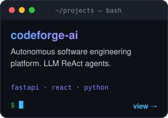
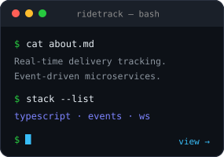

## About Me

- 🧠 Full-stack dev who ends up building AI agents more often than not
- 🛠️ Deep in FastAPI, React, and RAG systems right now
- 📈 Learning system design and cloud infra on the side
- 🎵 Off-screen: music, painting, and anything worth chasing
- ⚡ Currently building: **GetHired** — a web app that finds and applies to jobs for me

## Tech Stack

`LANGUAGES`

`FRAMEWORKS & BACKEND`

`AI & DATA`

`DATABASES`

`DEVOPS & TOOLS`

## Projects

  

## GitHub Activity

## Connect

[⬆ back to top](#about-me)

